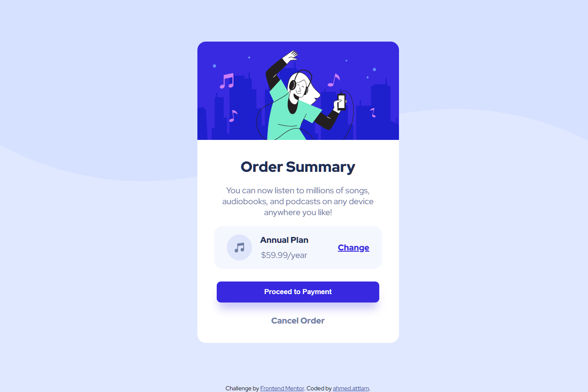

# Frontend Mentor - Order summary card solution

This is a solution to the [Order summary card challenge on Frontend Mentor](https://www.frontendmentor.io/challenges/order-summary-component-QlPmajDUj).

## Overview

### The challenge

Users should be able to:

- See hover states for interactive elements

### Screenshot

### Links

- Solution URL: [solution URL](https://github.com/ahmedattlam10/Order-summary-component)
- Live Site URL: [live site URL](https://ahmedattlam10.github.io/Order-summary-component/)

## My process

### Built with

- Semantic HTML5 markup
- CSS custom properties
- Flexbox
- Mobile-first workflow
- hover & focus states
- transition

## Author

- Website - [github-profile](https://github.com/ahmedattlam10)
- Frontend Mentor - [front-end mentor-profile](https://www.frontendmentor.io/profile/ahmedattlam10)

